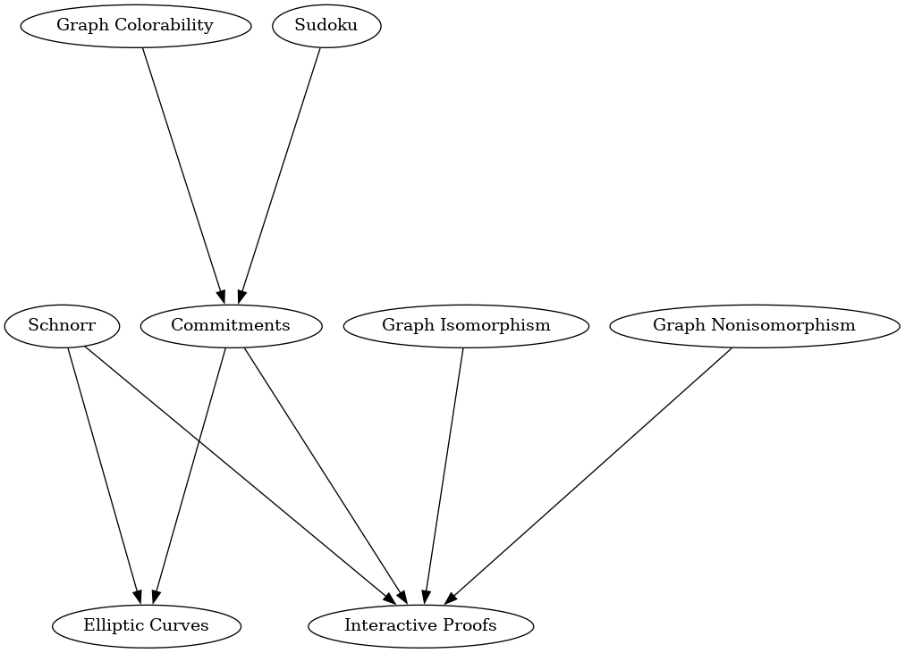

# Getting to Know Zero-Knowledge

Everyone talks about zero-knowledge proofs (ZKP), but who understands them? How can a proof consist of bytes without leaking any knowledge? Why should I trust such a proof?

## What this is

This is a workshop about ZKP written in Python. We use Jupyter as our interactive learning environment. The notebooks cover fundamentals, applications and much more. Go through them in any order you want. Do what interests you and skip everything else. It's a lot of fun :)

## What this _isn't_

We will not cover the latest and shiniest crypto. We will not build SNARKs, STARKs or validity rollups. The code you will see will not live up to the highest security standards _(we intentionally use insecure parameters to facilitate the learning process)_.

## Rationale

Master the basics first, then move to the advanced stuff; that is my philosophy. Let's build an intuition for how ZKP works. We start small and work our way up. Things become simpler when we break them down into their constituent parts. Divide and conquer. Once there is understanding, we can take what we learned here and apply it to real problems.

## Building

We have come a long way since this workshop used sagemath (1 GB). The new dependencies should not take more than 50 MB :)

### Using nix

Use the provided nix shell to set up the runtime environment.

```
nix-shell
```

### Using pip and package manager

Create a virtual environment and use pip to install the dependencies.

```
python3 -m venv venv && source venv/bin/activate
pip install -r requirements.txt
```

## Running

Run Jupyter on the command line.

```
jupyter notebook
```

A browser window will open. Then select a chapter to read.

## Chapter dependencies

Some chapters depend on lessons from other chapters.

Start with chapters that depend on nothing else and work your way down the dependency tree, towards more advanced chapters.

Skip / skim lessons you already know. Look at what interests you and ignore everything else. Have fun :)



## Extras

### Hardness of the discrete logarithm

See how the curve points jump in 2D space as you iterate through the curve.

```
python3 hardness_dlog.py
```

### Playing Sudoku

Play the side of Victor in an interactive proof of knowledge of a Sudoku solution. Accept or reject. Peggy might be lying!

```
python3 play_sudoku.py
```

### Customization

Look at [the documentation](https://github.com/uncomputable/zkp-workshop/blob/master/customization.md) for how to further customize the workshop.

## Recommended reading

- [Number theory explained from first principles](https://explained-from-first-principles.com/number-theory/)
- [Tackling bulletproofs](https://github.com/uncomputable/tackling-bulletproofs)
- [ZKP explained in 3 examples](https://www.circularise.com/blogs/zero-knowledge-proofs-explained-in-3-examples)
- [Computer scientist explains ZKP in 5 levels of difficulty](https://www.youtube.com/watch?v=fOGdb1CTu5c)
- [How to explain ZKP to your children](https://pages.cs.wisc.edu/~mkowalcz/628.pdf)
